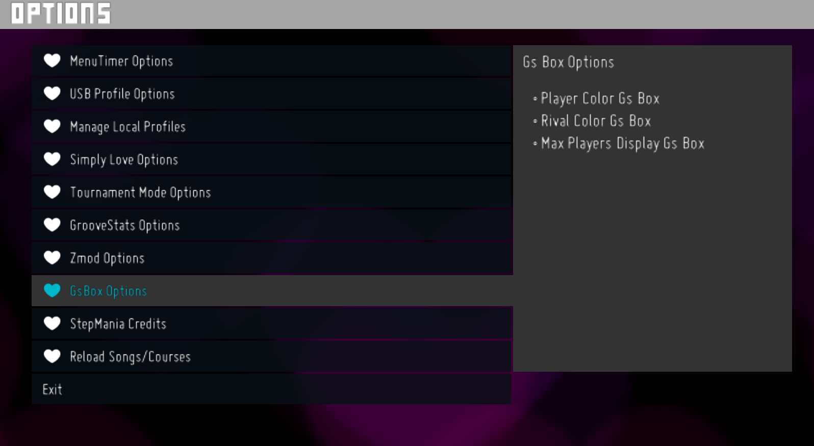

# Gs Box Preferencias para Simply Love ZMod / Gs Box Preferences for Simply Love ZMod
Implementación de Preferencias para Groove Stats Box / Implementation of Preferences for Groove Stats Box


## Tabla de Contenidos / Table of Contents
- [Descripción/Description](#descripción)
- [Características/Features](#características)
- [vista/view](#vista)
- [Codigo/Code](#codigo)
- [Instalación/Installation](#instalación)
- [Advertencias/Warnings](#advertencias)

# descripción
Siempre me propuse a agregar cosas a Simply Love de **Zarzob** y **Zankoku** así que después de leer todo en la guía de desarrollo que tiene el juego logre entender como hacer dichas modificaciones las cuales con ayuda de Zarzob logre hacer mi propia modificación la cual salió de la idea de que la Gs Box solo mostraba los mejores 5 jugadores y yo en mi BoogieStats tengo 9 rivales y que aumentaran en el futuro entonces fue cuando surgió la idea de ver como lograr dicha tarea con algo de tiempo y mucha lectura de código que aún no entiendo del todo logre hacer que la Gs Box pueda tener asta un máximo de 15 jugadores además de reposicionar en pantalla este elemento y como plus agregue la opción de elegir qué color se muestra el jugador y el rival en la Gs Box / I always intended to add things to Simply Love by **Zarzob** and **Zankoku** so after reading everything in the development guide that the game has I managed to understand how to make these modifications which with the help of Zarzob I managed to make my own modification which came from the idea that the Gs Box only showed the best 5 players and I in my BoogieStats have 9 rivals and that will increase in the future so that was when the idea arose to see how to achieve this task with some time and a lot of reading of code that I still do not fully understand I managed to make the Gs Box can have up to a maximum of 15 players in addition to repositioning this element on the screen and as a plus I added the option to choose what color the player and the rival are displayed in the Gs Box

# características
- Aumento de jugadores máximos en la Gs Box / Increased maximum player count in the Gs Box

- Cambio de color para el jugador en la Gs Box / Changed player color in the Gs Box

- Cambio de color para el rival en la Gs Box / Changed opponent color in the Gs Box


# vista
- Pantalla de opciones / Options screen

- Vista en juego / View in game


# codigo
- Máximo de jugadores en pantalla / Maximum number of players on screen
```lua
local NumEntries = ThemePrefs.Get("MaxPlayersDisplayGsBox") -- Set Mx players 5-15
```

# instalación
Proximamente/Soon...

# advertencias
- !Esta modificacion solo funciona en los lenguajes del juego Español y Ingles! / !This mod only works in the game languages Spanish and English!
- !Al usar más de 5 jugadores en pantalla puede que surjan bugs como que los nombres queden visibles aun cuando se está cambiando de canción(puede que no lo arregle para no saturar tanto el código de la gs box es solo una excepción visual)! / !When using more than 5 players on screen, bugs may arise such as names remaining visible even when changing songs (I may not fix this to avoid cluttering the gs box code, it's just a visual exception)!
- !Esta modificación en 2 jugadores en partida rompe la gs box por la forma en la que se muestra por favor dejar las opciones de máximo de jugadores en 5(trataré de arreglar eso para que se desactive de manera automática en 2 jugadores)! / !This 2 player mod breaks the gs box the way it displays, please leave the max player options at 5 (I'll try to fix that so it automatically disables in 2 players)!
